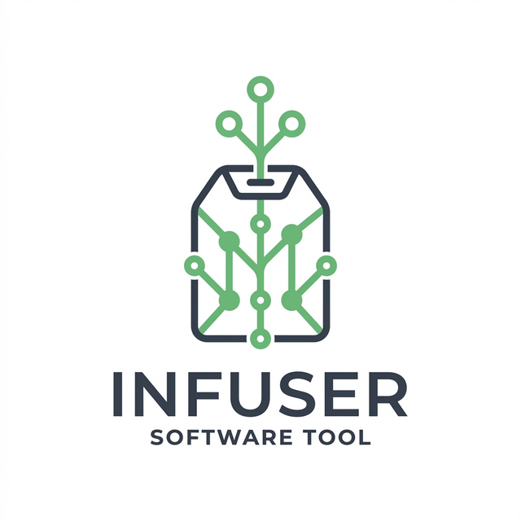

<p align="center">
  
</p>

# Infuser

> **Inspired by [Goliac](https://github.com/goliac-project/goliac)**: Infuser takes direct inspiration from Goliac's architectural and philosophical principles to offer a native and lightweight solution for Gitea server administration.

Infuser is an **Infrastructure as Code (IaC)** engine specifically designed to manage Gitea and Forgejo servers.

Instead of creating users, teams, and repositories manually through the web interface, Infuser allows you to manage the platform by defining the desired state in YAML files hosted in a central Git repository (`infuser-config`).

## Core Features

1. **Declarative Management (IaC)**
   Define users, organizations, teams, members, and repositories using simple and readable `.yaml` files.

2. **Self-Service and Transparent Auditing**
   Any developer can request the creation of a repository or access to a team by creating a *Pull Request* (PR) in the configuration repository. All changes are version-controlled, creating an immutable audit log of "who has access to what." Approvals are naturally managed through code reviews.

3. **Engine Automation**
   The core of this project is the Reconciler engine, written in modern Python using `uv`. It periodically compares the YAML configuration against the Gitea server and executes the necessary changes (create, modify, or archive).

4. **Local Memory and Notifications**
   It features a local state system that allows for agile notification to teams when their requests have been applied to the server, without needing to constantly hit the API for 100% of the state.

5. **Visual Anti-Shadow IT Auditing 🛡️**
   Includes built-in report generators (interactive `status_report.md` and CSV/Markdown matrices) that graphically document which teams, direct users, and external collaborators have access to organization projects and personal repositories, also visualizing Branch Protections without the need to manually navigate Gitea.

## Quick Start

### Prerequisites
- Python >= 3.12 (Recommended)
- `uv` (Ultra-fast Package Manager)

### Installation

1. Clone this project.
2. Sync dependencies with `uv`:
   ```bash
   uv sync
   ```
3. Copy the example environment file:
   ```bash
   cp .env.example .env
   ```
4. Edit the `.env` file and insert your personal admin `GITEA_READ_TOKEN`/`GITEA_WRITE_TOKEN` and adjust the `GITEA_URL`.

### Usage

The easiest way to use Infuser is through the interactive launcher:
```bash
uv run main.py
```
It displays a numbered menu with all available actions and a short description for each one. Simply select an option by number.

You can also run scripts directly:
```bash
# Show execution plan without making changes (dry-run)
uv run scripts/core_engine.py

# Apply changes to Gitea (with confirmation prompt)
uv run scripts/core_engine.py --apply

# Export current Gitea state to local YAML files
uv run scripts/export_state.py

# Generate reports (saved under output/reports/)
uv run scripts/generate_report.py           # Visual status report
uv run scripts/generate_user_report.py      # User access / offboarding report
uv run scripts/generate_matrix_report.py    # Access matrix (CSV + Markdown)
uv run scripts/generate_repo_grid.py        # Repository grid (CSV + Markdown)
```

For a complete reference of all scripts and options, see the [Operations Manual](docs/operations_manual.md).

## Project Documentation

All technical and architectural documentation resides in the `docs/` folder. We recommend reviewing the following fundamental documents:

- [Operations Manual (Runbook)](docs/operations_manual.md)
- [Architecture (Engine Specs)](docs/architecture.md)
- [User Journeys and Stories](docs/user_journeys_stories.md)
- [Architecture Decision Records (ADRs)](docs/decisions.md)
